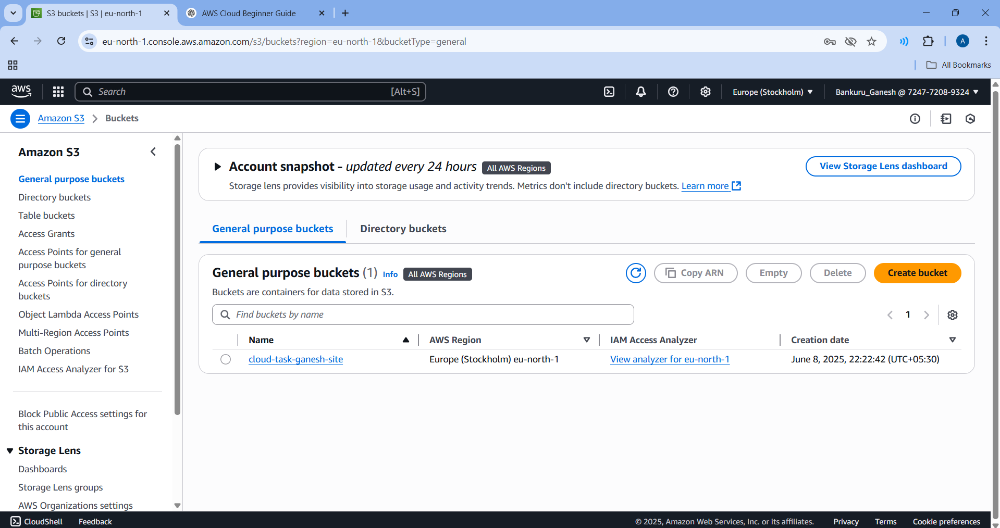
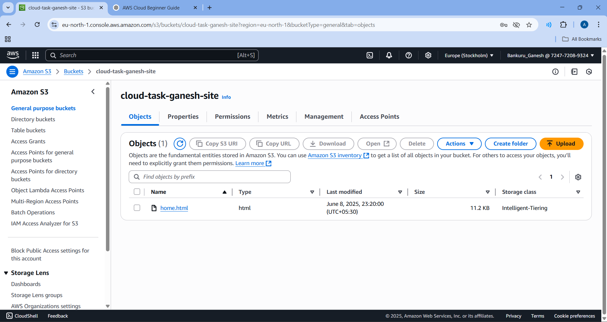
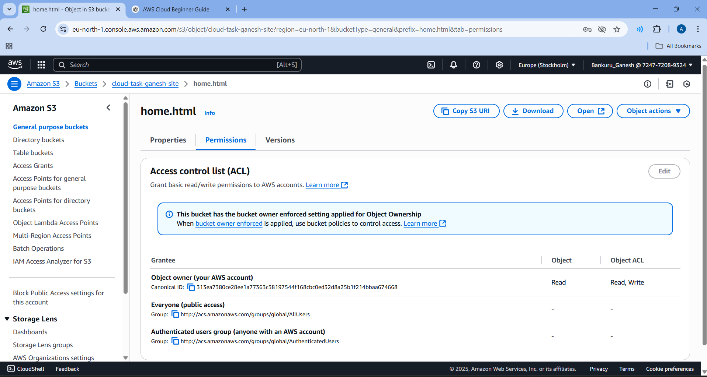
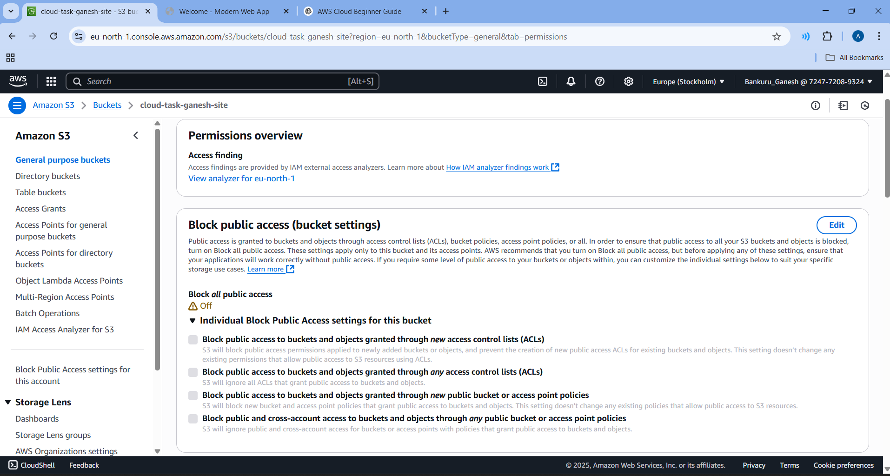
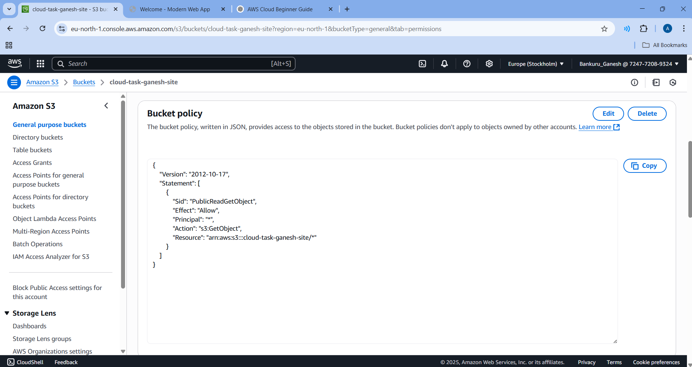
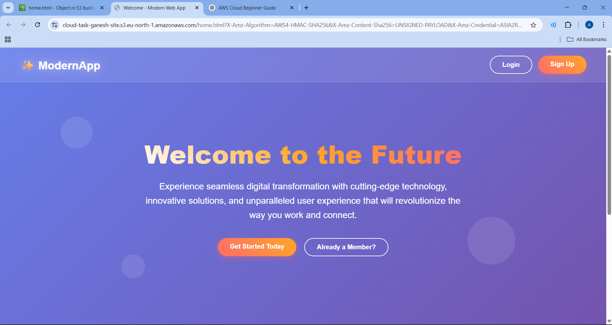

*COMPANY*: CODTECH IT SOLUTIONS

*NAME*: GANESH BANKURU

*INTERN ID*: CT06DF1421

*DOMANIN*: CLOUD COMPUTING

*DURATION*: 6 WEEKS

*MENTOR*: NEELA SANTOSH

As part of my first task, I used the AWS Free Tier to create and configure an S3 bucket for hosting a static website. Using the 5 GB free storage provided by the Free Tier, I uploaded files like index.html and images, and enabled static website hosting. I also configured bucket permissions to allow public access so the site could be viewed from any browser. This task demonstrated how to efficiently use S3 within Free Tier limits to deploy and share web content.

Task 1: Create a s3 bucket and Host a Static Website on AWS S3

step 1: Create a New S3 Bucket Go to the AWS S3 Console

Click "Create bucket"

Enter

Bucket name: ganesh-cloud-store

Region: eu-north-1

Uncheck "Block all public access" under permissions

Click Create bucket

Step 2: Upload Website Files .Go to the Objects tab in your bucket

Click Upload

Upload files like index.html, style.css, image.jpg, etc.

Leave permissions as default (bucket policy handles access)

Step 3: Enable Static Website Hosting
Go to Properties > Static website hosting

Click Edit

Choose: Enable

Index document: index.html

Save

Step 4: Set Bucket Permissions:

Go to Bucket > Permissions > Block Public Access

Click Edit, and uncheck all options

Save changes to allow public access

Step 5: Add Public Read Bucket Policy:

Go to Permissions > Bucket policy

Paste this policy:

{
  "Version": "2012-10-17",
  "Statement": [
    {
      "Sid": "AllowPublicReadAccess",
      "Effect": "Allow",
      "Principal": "*",
      "Action": "s3:GetObject",
      "Resource": "arn:aws:s3:::instagramposts-store/*"
    }
  ]
}

Step 6: Access the Website Publicly

You will receive a Website endpoint URL like:

http://instagramposts-store.s3-website-us-west-1.amazonaws.com
By using this we can access the website anywhere from internet as shown below.

